# Active Context

## What we're working on now
**CRITICAL DISCOVERY**: Tool calling implementation for **Roo Code VSCode plugin integration**
- **Project Goal**: Letta Proxy to act as OpenAI-compatible endpoint for Roo Code
- **Key Clarification**: **Roo Code executes tools, not the LLM**
- **Current Issue**: Proxy accepts tools but doesn't pass them to Letta agent

## Architecture Understanding (CORRECTED)
### The Right Flow
```
Roo Code → Proxy (OpenAI format) → Letta Agent → Proxy → Roo Code
1. Roo Code defines tools and sends to proxy
2. Proxy forwards tool definitions to Letta agent
3. Letta agent generates tool calls (doesn't execute them)
4. Proxy returns tool calls to Roo Code
5. **Roo Code executes the actual tools**
```

### The Problem (IDENTIFIED)
**Current proxy implementation**:
- ✅ **Accepts** tools from OpenAI requests (line 41 in main.py)
- ✅ **Handles** tool call responses from Letta agent
- ❌ **NEVER passes** tools to Letta agent in API calls

**Root cause**: Missing tools parameter in Letta API calls
- Streaming: `client.agents.messages.create_stream()` - no tools parameter
- Non-streaming: `client.agents.messages.create()` - no tools parameter

## Recent changes & findings
- ✅ **Streaming Implementation**: PERFECT - 157 chunks, real-time, production-ready
- ✅ **OpenAI API Compliance**: PERFECT - reasoning fields, tool call formatting
- ✅ **Real-time Performance**: 7.60s response time with 157 chunks
- ✅ **Agent Communication**: Successfully connected to Letta Cloud
- ❌ **Tool Calling**: FUNDAMENTAL ARCHITECTURAL LIMITATION DISCOVERED
- 📋 **Investigation**: Letta SDK does NOT support tools parameter in message calls

## CRITICAL DISCOVERY: Letta Architecture Limitation
### The Problem (CONFIRMED)
**Letta SDK Documentation Analysis**:
- ❌ **NO tools parameter** in `agents.messages.create()` method
- ❌ **NO tools parameter** in `agents.messages.create_stream()` method
- ❌ **NO dynamic tool support** in message creation APIs
- ✅ **Tools only configured** during agent creation via `tool_variables` parameter

### Architecture Reality Check
**This is NOT a bug in our proxy - it's a fundamental Letta platform limitation**:
- Letta agents require tools to be pre-configured at agent creation time
- Dynamic tool definition (like OpenAI) is NOT supported by Letta
- Tools must be added to agents via `client.agents.tools.attach()` or during agent creation
- Message creation APIs only accept: `agent_id`, `messages`, `max_steps`, `use_assistant_message`, etc.

### Key Insight (UPDATED)
**The solution is NOT simple parameter passing**:
- This requires architectural changes to how tools are managed
- Need to investigate agent-level tool configuration methods
- May need to implement tool bridge that manages agent tool state
- Could require agent recreation or tool attachment workflows

## Solution Design: Proxy Tool Bridge (BRILLIANT)

### Architecture Approach
**Proxy Tool Pattern**: Create ephemeral "proxy tools" that format OpenAI calls for downstream execution

### System Architecture Diagram

```mermaid
graph TB
    subgraph "Roo Code Integration"
        RC[Roo Code<br/>VSCode Plugin] -->|1. OpenAI Tools| LP[Letta Proxy]
        LP -->|4. Tool Results| RC
    end

    subgraph "Letta Proxy (Our Code)"
        LP --> PTB[Proxy Tool Bridge]
        PTB --> OTC[OpenAI→Letta<br/>Converter]
        PTB --> PTR[Proxy Tool<br/>Registry]
        PTB --> TCF[Tool Call<br/>Formatter]
        PTB --> RFM[Result Forwarding<br/>Manager]
        PTB --> ATM[Agent Tool<br/>Manager]
        PTB --> TID[Tool ID<br/>Mapping]
        PTB --> CLN[Cleanup<br/>Manager]
    end

    subgraph "Letta Platform"
        PTR -->|2. Create Proxy Tools| LT[Letta Tools<br/>API]
        ATM -->|3. Attach Proxy Tools| LA[Letta Agents<br/>API]
        LA -->|5. Execute Proxy Tools| Agent[Letta Agent<br/>Execution]
        Agent -->|6. Formatted Calls| LA
    end

    LT -.->|Tool IDs| TID
    Agent -.->|7. Tool Call Response| LP

    style LP fill:#e1f5fe
    style PTB fill:#f3e5f5
    style Agent fill:#e8f5e8
```


### Architecture Approach
**Proxy Tool Pattern**: Create ephemeral "proxy tools" that format OpenAI calls for downstream execution

### Solution Components
1. **OpenAI → Letta Tool Converter**: Transform OpenAI tool definitions to Letta tool format
2. **Dynamic Tool Registry**: Create and cache tools as needed (upsert pattern)
3. **Agent Tool Manager**: Attach/detach tools from agents per request
4. **Tool ID Mapping**: Maintain mapping between OpenAI function names and Letta tool IDs
5. **Cleanup Manager**: Remove temporary tools after requests complete

### Technical Implementation
```python
# 1. Convert OpenAI tools to Letta format
def convert_openai_to_letta_tools(openai_tools):
    letta_tools = []
    for tool in openai_tools:
        letta_tool = {
            'source_code': generate_python_function(tool),
            'json_schema': tool['function'],
            'description': tool['function']['description'],
            'name': tool['function']['name']
        }
        letta_tools.append(letta_tool)
    return letta_tools

# 2. Dynamic tool creation and attachment
async def setup_dynamic_tools(agent_id, openai_tools):
    tool_ids = []
    for tool_def in convert_openai_to_letta_tools(openai_tools):
        # Create or get existing tool
        tool = client.tools.upsert(**tool_def)
        tool_ids.append(tool.id)

        # Attach to agent
        client.agents.tools.attach(agent_id, tool.id)

    return tool_ids

# 3. Cleanup after request
async def cleanup_dynamic_tools(agent_id, tool_ids):
    for tool_id in tool_ids:
        client.agents.tools.detach(agent_id, tool_id)
```

## Implementation Plan: Proxy Tool Bridge (BRILLIANT)

### Architecture Overview
**Proxy Tool Pattern**: Create ephemeral proxy tools that format calls for downstream execution

### Key Components
1. **OpenAI→Letta Converter**: Transform OpenAI tool definitions to Letta format
2. **Proxy Tool Registry**: Create dummy tools that return formatted tool calls
3. **Tool Call Formatter**: Format calls for OpenAI-compatible response structure
4. **Result Forwarding Manager**: Handle tool results from downstream clients
5. **Agent Tool Manager**: Attach/detach proxy tools to/from agents
6. **Tool ID Mapping**: Map OpenAI function names to Letta proxy tool IDs
7. **Cleanup Manager**: Remove ephemeral proxy tools after use

### Implementation Strategy
```python
# 1. Smart Tool Registry Management
def sync_agent_tools(agent_id, openai_tools):
    """Sync agent tools to match exactly what's in the request"""
    # Get current agent tools
    current_tools = client.agents.tools.list(agent_id)
    current_tool_names = {tool.name for tool in current_tools}

    # Calculate differences
    requested_tool_names = {tool['function']['name'] for tool in openai_tools}

    # Remove tools not in request
    to_remove = current_tool_names - requested_tool_names
    for tool_name in to_remove:
        tool_id = find_tool_id_by_name(current_tools, tool_name)
        if tool_id:
            client.agents.tools.detach(agent_id, tool_id)

    # Add tools in request but not on agent
    to_add = requested_tool_names - current_tool_names
    for openai_tool in openai_tools:
        if openai_tool['function']['name'] in to_add:
            proxy_tool = create_proxy_tool(openai_tool)
            client.agents.tools.attach(agent_id, proxy_tool.id)

# 2. Create Proxy Tool
def create_proxy_tool(openai_tool_def):
    return client.tools.upsert(
        source_code=f"""
def {openai_tool_def['function']['name']}({generate_args(openai_tool_def)}):
    # Format call for downstream consumption
    return {{
        "type": "tool_call",
        "tool_call_id": generate_id(),
        "function": {{
            "name": "{openai_tool_def['function']['name']}",
            "arguments": json.dumps({generate_arg_mapping(openai_tool_def)})
        }}
    }}
""",
        description=f"Proxy tool for {openai_tool_def['function']['name']}",
        json_schema=openai_tool_def['function']
    )

# 3. Process tool calls from Letta
def process_proxy_tool_calls(letta_response, tool_mapping):
    for tool_call in letta_response.tool_calls:
        if tool_call.id in tool_mapping:  # Proxy tool
            # Forward to downstream client
            result = forward_to_client(tool_call)
            # Format result for Letta consumption
            return format_for_letta(result, tool_call.id)
        else:  # Letta internal tool
            # Handle normally
            pass
```

## Next steps (IMPLEMENTABLE)
1. **Create Proxy Tool Bridge Module**: Implement OpenAI→Letta proxy tool conversion
2. **Implement Smart Tool Registry**: Sync agent tools to match request exactly
3. **Create Tool Call Formatter**: Format calls in OpenAI-compatible structure
4. **Implement Result Forwarding**: Handle results from downstream clients back to Letta
5. **Create Agent Tool Manager**: Attach/detach proxy tools to/from agents
6. **Implement Tool ID Mapping**: Map OpenAI names to Letta proxy tool IDs
7. **Add Cleanup Mechanism**: Remove tools not in current request
8. **Update Main API**: Integrate proxy tool bridge into existing endpoints
9. **Test Simple Tool**: Calculator function to verify end-to-end flow
10. **Test with Roo Code**: Validate integration with VSCode plugin

## Current System State
- **Streaming**: PRODUCTION READY ✅
- **Basic Chat**: PRODUCTION READY ✅
- **Tool Calling**: BLOCKED (implementation issue, not architecture) 🔧
- **OpenAI Compliance**: PRODUCTION READY ✅

## Key Technical Findings
1. **Agent**: `companion-agent-1758429513525` on Letta Cloud
2. **Root Cause**: Missing tools parameter in Letta API calls (lines 132, 296 in main.py)
3. **Architecture**: Much simpler than initially thought - just need to bridge tool definitions
4. **Solution Scope**: Simple parameter passing, not complex tool management

## Confidence Level
- **Streaming**: 10/10 (production-ready)
- **Tool Calling**: 7/10 (root cause identified, solution path clear)
- **Next Steps**: 9/10 (need to research Letta tool parameter format)